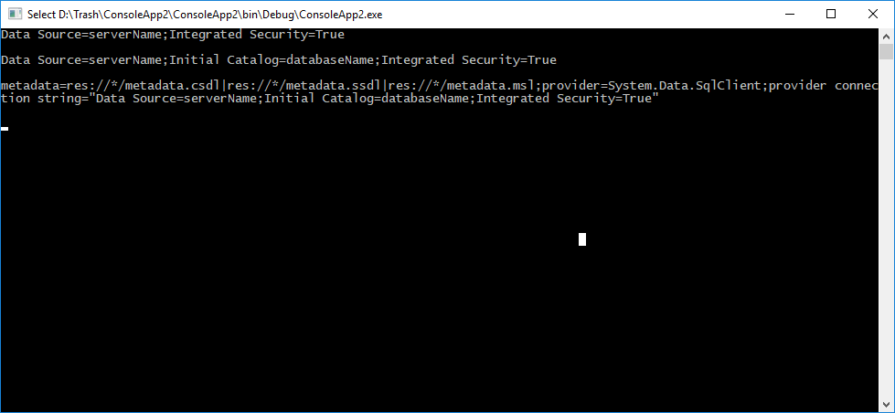

<!--Category:C#,PowerShell--> 
 <p align="right">
        <a href="https://www.nuget.org/packages/ProductivityTools.EntityFrameworkConnectionString/"></a>
        <a href="http://productivitytools.tech/connectionstringlightpt/"><a> 
        <a href="https://github.com/pwujczyk/ProductivityTools.EntityFrameworkConnectionString"></a>
</p>
<p align="center">
    <a href="http://productivitytools.tech/">
        
    </a>
</p>

# EntityFrameworkConnectionString

EntityFrameworkConnectionString generates connection string in c# code.

<!--more-->


Connection string can be prepared in 3 format:

- SqlDataSource – just name of the server without database name – usefull for creation database in code
- SqlServer – most popular connection string with server name and database name
- EntityFramework – connection string used to initialize EntityFramework context

Folowing code

```c#
 var serverName=ConnectionStringHelper.ConnectionString.GetSqlDataSourceConnectionString("serverName");
 Console.WriteLine(serverName);
 Console.WriteLine();
 var serverNameWithDatabase= ConnectionStringHelper.ConnectionString.GetSqlServerConnectionString("serverName","databaseName");
 Console.WriteLine(serverNameWithDatabase);
 Console.WriteLine();
 var entityFramework = ConnectionStringHelper.ConnectionString.GetSqlEntityFrameworkConnectionString("serverName", "databaseName", "metadata");
 Console.WriteLine(entityFramework);
 Console.WriteLine();
 ```

 Will result in following connection strings:


